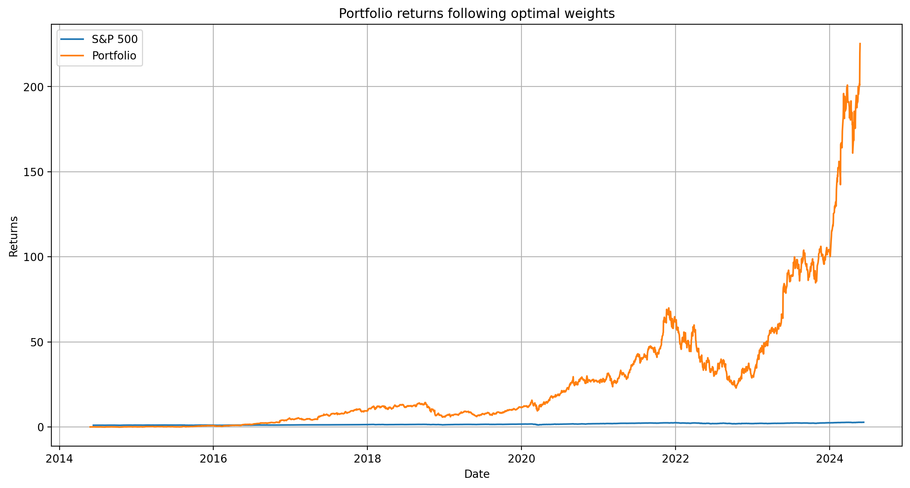
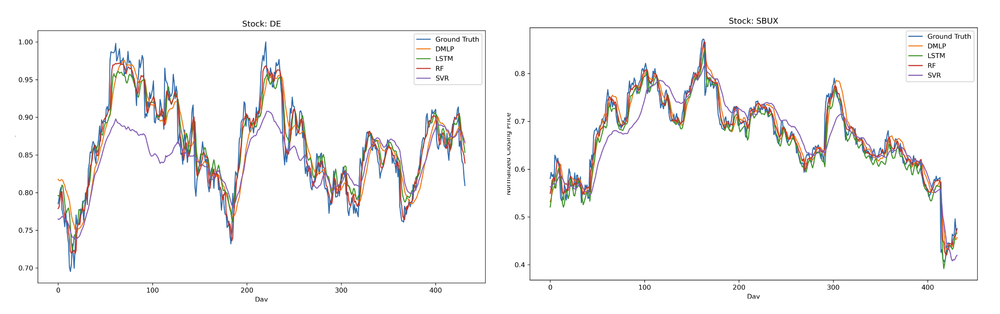

# Portfolio Optimization with Machine Learning

[embed]https://kylewade.dev/stock_portfolio_optimization.pdf[/embed]

> Yalu Ouyang, Darell Chua, Dirk Xie, Kyle Wade

In our project, we set out to tackle the problem of portfolio optimization - changing the weighting consituent stocks for maximum return on investment - through the application of machine learning techniques.

To do so, we've compiled stock prices of dozens of publicly listed companies over the period 2014-2024, and performed experiments with stock portfolios constructed from this dataset.

Our methodology breaks down to 3 different approaches:

- MVO (mean-variance optimization) and MVO-based Neural Networks
- Neural Network with separate optimizer
- Neural Network with embedded optimizer

## MVO and MVO-based Neural Networks

## Neural Network with separate optimizer

## Neural Network with embedded optimizer

